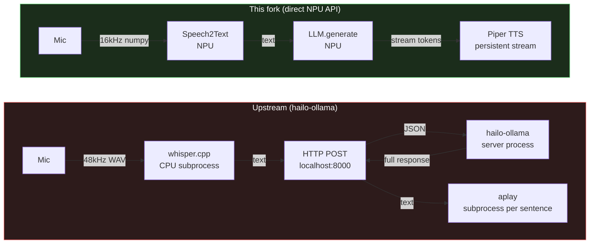

# Be More Agent — Hailo-10H Edition

<p align="center">
  
  
</p>

On-device conversational AI agent (BMO from Adventure Time) for **Raspberry Pi 5 + Hailo-10H NPU**. Wake word, STT, LLM, TTS, vision — all local, no cloud.

Fork of [@moorew/be-more-hailo](https://github.com/moorew/be-more-hailo) (itself from [@brenpoly/be-more-agent](https://github.com/brenpoly/be-more-agent)). This fork replaces the HTTP-based `hailo-ollama` inference stack with direct `hailo_platform.genai` Python APIs.

---

## What changed

Upstream routes everything through an HTTP server (`hailo-ollama` on `localhost:8000`). This fork calls the NPU directly — no server, no serialization.



| Component | Before (upstream) | After (this fork) | Delta |
|---|---|---|---|
| LLM inference | HTTP to hailo-ollama | `hailo_platform.genai.LLM` | First token 0.55s → 0.37s |
| Speech-to-text | whisper.cpp (CPU subprocess) | `Speech2Text` (NPU) | 1.91s → 0.26s |
| TTS playback | `aplay` subprocess per sentence | Persistent `sounddevice` stream | Zero process overhead |
| System prompt | Re-processed every turn | KV cache at boot | Processed once |
| Response | Wait for full response, then speak | Stream per sentence | First sentence <0.5s |
| Vision (VLM) | `pkill hailo-ollama` | Clean subprocess + dedicated VDevice | No crashes |

### NPU model sharing

LLM (Qwen 2.5, 2.3GB) and Whisper STT (125MB) coexist on a shared `VDevice(group_id="SHARED")`. VLM (Qwen2-VL, 2.3GB) cannot coexist with the LLM — HailoRT 5.1.1 only allows one generative model at a time. VLM runs in a forked subprocess: release LLM → fork → VLM inference → child exits → reload LLM.

---

## What runs where

| Component | Runtime | Model | Notes |
|---|---|---|---|
| LLM | Hailo-10H NPU | Qwen2.5-1.5B-Instruct | Direct Python API, KV-cached system prompt |
| VLM | Hailo-10H NPU | Qwen2-VL-2B-Instruct | Subprocess (one generative model at a time) |
| STT | Hailo-10H NPU | Whisper-Base | Shared VDevice with LLM; whisper.cpp CPU fallback |
| TTS | CPU | Piper en_GB-semaine-medium | Persistent audio stream, sentence-by-sentence |
| Wake word | CPU | OpenWakeWord (wakeword.onnx) | Suppressed during speech/music |

---

## Hardware

- Raspberry Pi 5 (4GB or 8GB)
- Raspberry Pi AI HAT 2+ (Hailo-10H)
- USB microphone + speaker
- HDMI or DSI display
- Raspberry Pi Camera Module (optional, for vision)

---

## Installation

Requires Raspberry Pi OS 64-bit with `hailo-h10-all` installed.

```bash
curl -sSL https://raw.githubusercontent.com/moorew/be-more-hailo/main/setup.sh | bash
cd be-more-agent
```

The script installs system packages, blacklists the legacy `hailo_pci` driver, downloads Piper TTS + model HEFs, compiles whisper.cpp (CPU fallback), and sets up a venv with system site-packages enabled.

Manual:
```bash
git clone https://github.com/moorew/be-more-hailo.git be-more-agent
cd be-more-agent && chmod +x *.sh && ./setup.sh
```

---

## Running

```bash
# Web interface (kiosk mode — installs service + auto-opens Chromium)
./setup_web.sh

# Web interface (manual)
source venv/bin/activate && ./start_web.sh

# On-device GUI (fullscreen Tkinter)
source venv/bin/activate && ./start_agent.sh

# Systemd services
./setup_services.sh
sudo systemctl start|stop|restart bmo-gui  # or bmo-web
```

---

## Configuration

All settings in `core/config.py`. Key values:

```python
LLM_HEF_PATH     = "./models/Qwen2.5-1.5B-Instruct.hef"
VLM_HEF_PATH     = "./models/Qwen2-VL-2B-Instruct.hef"
WHISPER_HEF_PATH  = "./models/Whisper-Base.hef"
ALSA_DEVICE       = "plughw:UACDemoV10,0"   # aplay -l to find yours
MIC_DEVICE_INDEX  = 1
MIC_SAMPLE_RATE   = 48000
```

Env vars override at runtime: `ALSA_DEVICE`, `SILENCE_THRESHOLD`, `GEMINI_API_KEY`, `BMO_LANGUAGE`.

---

## Camera and vision

1. Enable the camera in `raspi-config`
2. `sudo apt install -y libcamera-apps`
3. Say "Hey BMO, what do you see?" — captures via `rpicam-still`, runs VLM on NPU

The VLM subprocess swap releases the LLM, forks a child with its own VDevice, runs inference, exits, then the parent reloads the LLM.

---

## Troubleshooting

**`/dev/hailo0` missing**

Driver conflict — blacklist the legacy driver:
```bash
echo "blacklist hailo_pci" | sudo tee /etc/modprobe.d/blacklist-hailo-legacy.conf
sudo rmmod hailo1x_pci 2>/dev/null; sudo rmmod hailo_pci 2>/dev/null
sudo modprobe hailo1x_pci
```

**`HAILO_OUT_OF_PHYSICAL_DEVICES` (status 74)**

Same root cause (`/dev/hailo0` missing). Also check if a kernel update broke DKMS:
```bash
ls /lib/modules/$(uname -r)/extra/hailo*  # should list .ko files
sudo apt reinstall h10-hailort-pcie-driver && sudo reboot  # if missing
```
Or another process holds the device: `lsof /dev/hailo0`.

**`HAILO_INVALID_OPERATION` / `HailoRTStatusException: 6`**

HEF/runtime version mismatch. Re-download:
```bash
HAILORT_VER=$(dpkg-query -W -f='${Version}' h10-hailort)
wget -O models/Qwen2-VL-2B-Instruct.hef \
    "https://dev-public.hailo.ai/v${HAILORT_VER}/blob/Qwen2-VL-2B-Instruct.hef"
```

**Bluetooth speaker not detected**

Install `pipewire-alsa` and set `ALSA_DEVICE=default`:
```bash
sudo apt install -y pipewire-alsa
python3 -c "import sounddevice; print(sounddevice.query_devices())"
```

**Vision says "my eyes aren't working"**

Check `hailo_platform` is importable in the venv:
```bash
python3 -c "from hailo_platform.genai import VLM; print('OK')"
grep include-system venv/pyvenv.cfg  # should say true
```

---

## Credits

Original concept and character by [@brenpoly](https://github.com/brenpoly/be-more-agent). Hailo-10H port with web interface by [@moorew](https://github.com/moorew/be-more-hailo). This fork adds direct NPU inference, modular `core/` architecture, and the performance work above.

**"BMO"** and **"Adventure Time"** are trademarks of Cartoon Network (Warner Bros. Discovery). Fan project, not affiliated.

---

## License

MIT — see [LICENSE](LICENSE).
